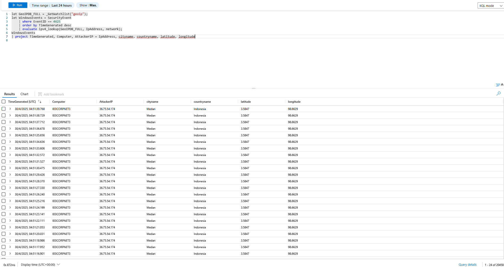
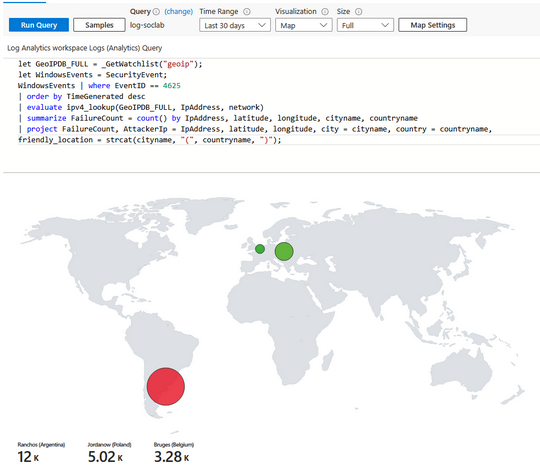
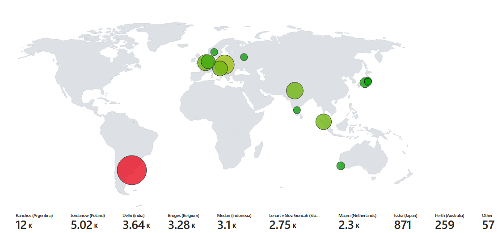
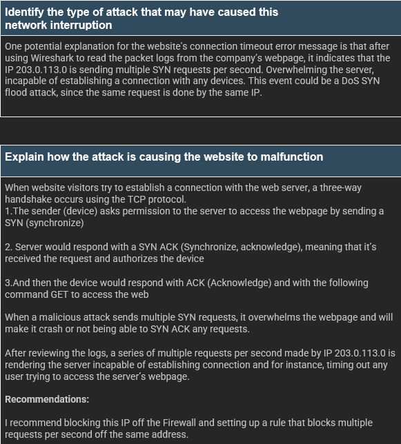
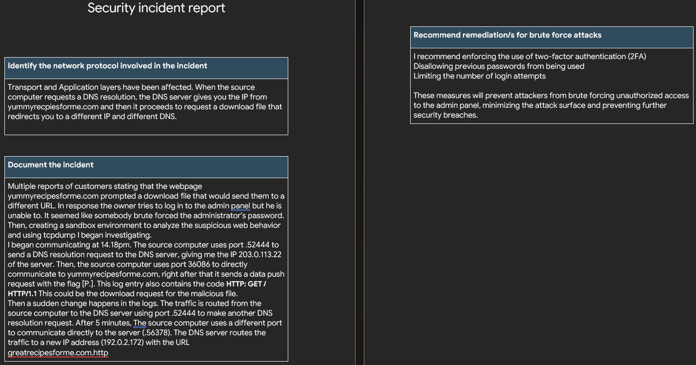

# Raul Rodriguez Maestra - Cybersecurity Analyst

Welcome to my cybersecurity portfolio! I'm an entry-level analyst passionate about digital privacy, threat detection, and incident response. My journey into cybersecurity began with a personal encounter with malware— and ever since, I’ve been committed to helping others and myself to protect their daily lives.

---

## About Me

My interest in technology goes back to watching videos about the latest computer hardware. But a personal security incident sparked my deep dive into cybersecurity. After detecting and removing a remote access trojan from my machine using Task Manager, I realized how vulnerable systems can be without proper defenses— and decided to change that for myself and others.

I focus on:
- Blue Team operations
- Security monitoring
- Threat detection
- Network forensics

---

## Key Projects

### Honeypot Lab with Azure Sentinel
- Deployed a **virtual machine on Azure** with Windows Firewall disabled for inbound access.
- Set up **Microsoft Sentinel** to log and monitor attacks.
- Pulled IP addresses and geolocation data to map attacks by **city and country**.
- Created visual dashboards and analytics to display attack patterns.
- Tools: Azure Cloud, Microsoft Sentinel, Log Analytics, Geolocation APIs

### Incident Reports: DoS/DDoS and Brute Force
- Used **Wireshark** and **TCPDump** to analyze simulated DoS/DDoS attacks.
- Documented traffic anomalies, identified payload signatures, and created structured incident reports.

**DoS Attack summary:**

**Brute Force Attack Summary:**

- The website's administrator login panel was inaccessible, raising suspicion of a brute-force attack targeting the admin password.
- Customers were redirected to a suspicious domain: greatrecipesforme.com (Instead of yummyrecipes)
- A sandbox environment was created to simulate and safely analyze the suspicious behavior.
Using TCPDump, I captured and analyzed the network traffic:
- At 14:18, the source system sent a DNS request using port 52444, resolving the original server IP: 203.0.113.22.
- The source then used port 36086 to communicate with yummyrecipesforme.com, followed by a data push flagged with [P.].
- The payload contained the HTTP request: **HTTP: GET / HTTP/1.1** —likely the trigger for the malicious file download.
After 5 minutes, a second DNS request was made via the same port.
- This time, the DNS response pointed to a new IP: 192.0.2.172, linked to greatrecipesforme.com.
- Communication was established via a new port: 56378, suggesting DNS spoofing or redirection as part of the compromise.

### Google Cybersecurity Certificate (Completed)
- Hands-on labs and coursework in risk management, network security, and detection methodologies.
- Python, SQL, SIEM usage
- Network protocols
- Security operations(Log analysis and event correlation)
- Incident reports and handling response scenarios
- Soft skills

---

## Skills & Tools

- **Monitoring & Detection**: Microsoft Sentinel, Azure Logs
- **Packet Analysis**: Wireshark, TCPDump
- **Scripting**: Bash, Python
- **Cloud**: Azure Virtual Machines, Virtual Networks, Oracle VM
- **Security Concepts and Hands-on**: Honeypots, DoS/DDoS, Threat Intelligence

---

## Certifications

- Google Cybersecurity Professional Certificate (2025)
- CompTIA Security+ (Expected by July 2025)

---

## Contact Me

- 🔗 [LinkedIn](https://www.linkedin.com/in/raul-rodriguez-maestra-b2624920a/)
- 📧 raromaestra98@gmail.com

---

> “Cybersecurity isn’t just about tools—it’s about thinking critically and staying ahead of threats.”

